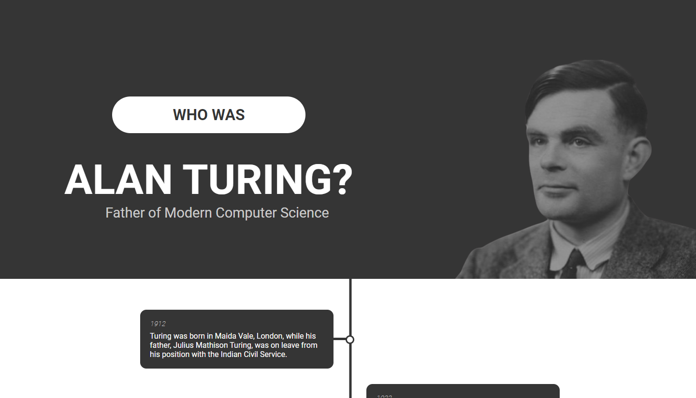

<h1>Alan Turing - Tribute Page</h1>
 This is a solution to the

[freeCodeCamp "Build a Tribute Page" challenge.](https://www.freecodecamp.org/learn/responsive-web-design/responsive-web-design-projects/build-a-tribute-page).

freeCodeCamp is a non-profit organization that consists of an interactive learning web platform, an online community forum, chat rooms, online publications and local organizations that intend to make learning web development accessible to anyone.

<!-- REPLACE HREFS -->

<h2>Overview</h2>
This project was one of the first projects I had created for my 2022 journey. After studying computer science, I thought Alan Turing was a fitting member of the programming world
to tribute to.

The most challenging part of this project was the time-line, created via the before & after pseudo elements.
